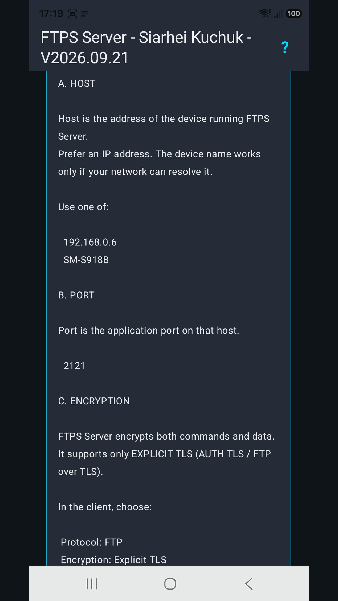
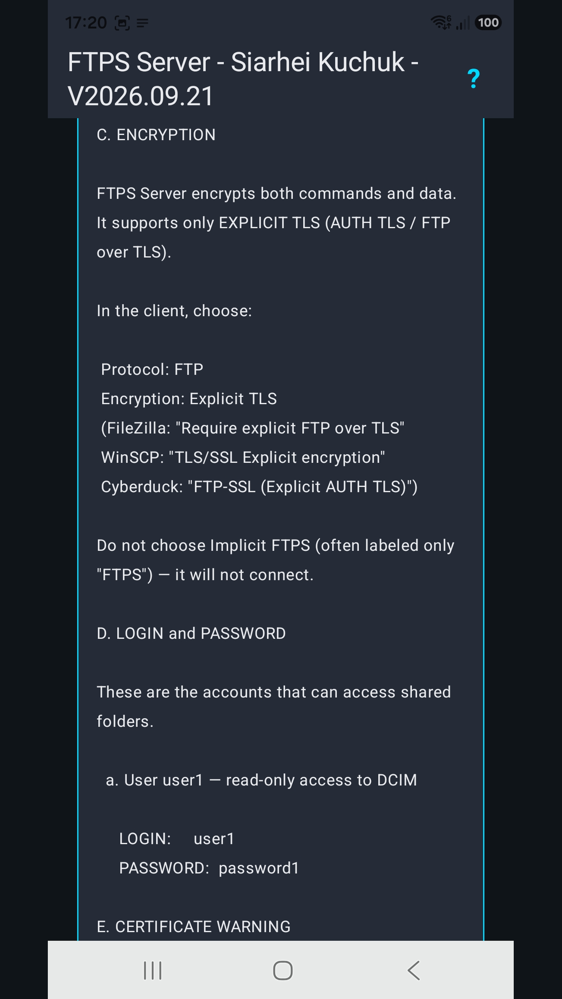
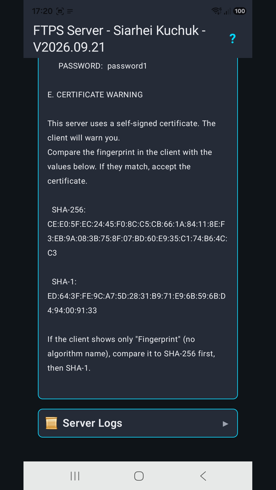
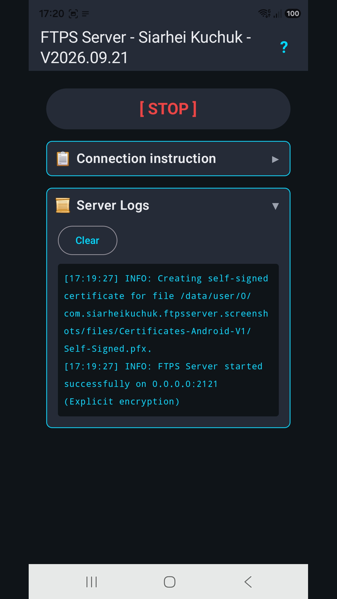
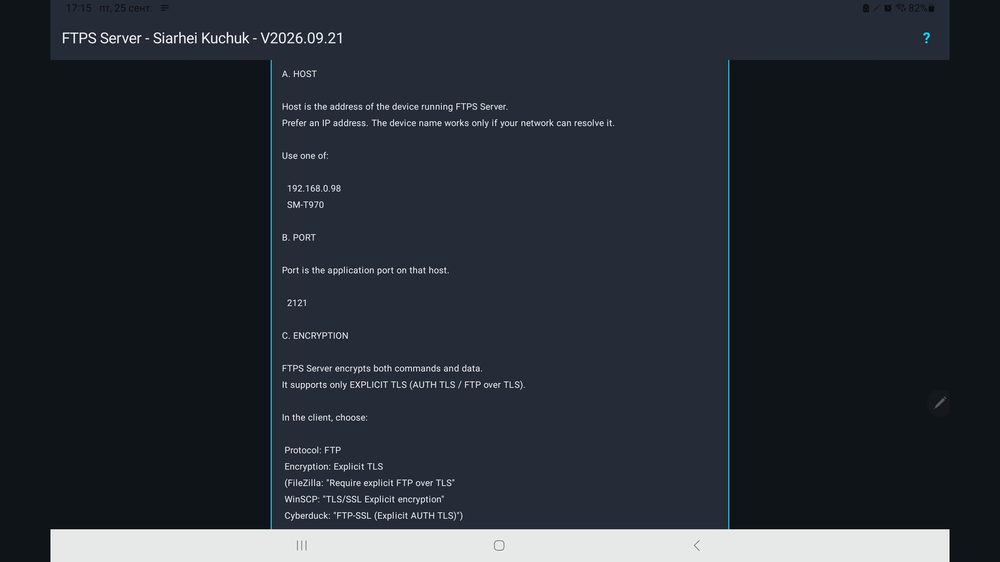
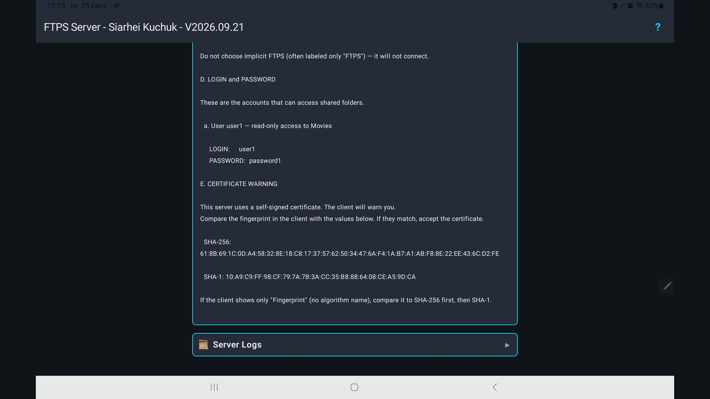
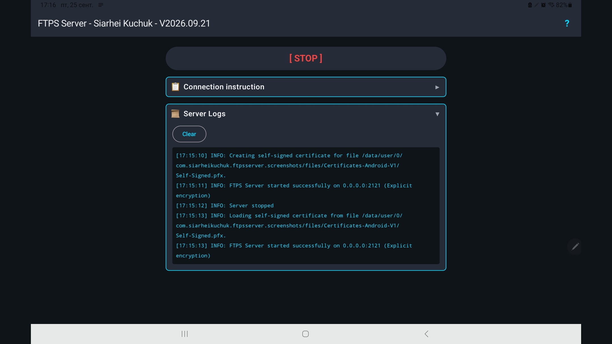

# Sharing files via FTPS betweeen devices over network.

Desktop app has WPF and Avalonia versions.
Console app is written in C# (.NET 10).
Android app has Avalonia and Kotlin versions.

<details>

<summary>✨ Features</summary>

- **User Permissions** - Granular control over Read/Write operations
- **Per-User Root Folders** - Isolated directories for each user
- **Path Security** - Protection against directory traversal attacks
- **UTF-8** - Supports localized characters
- **Localized** to Amharic — አማርኛ, Arabic — العربية, Bengali — বাংলা, Burmese — မြန်မာဘာသာ, Chinese Simplified — 简体中文, French — Français, German — Deutsch, Hausa — Hausa, Hindi — हिन्दी, Igbo — Igbo, Indonesian — Bahasa Indonesia, Italian — Italiano, Japanese — 日本語, Kazakh — Қазақша, Korean — 한국어, Marathi — मराठी, Nepali — नेपाली, Nigerian Pidgin — Naijá, Oromo — Afaan Oromoo, Pashto — پښتو, Persian — فارسی, Polish — Polski, Portuguese,Brazilian — Português do Brasil, Punjabi — ਪੰਜਾਬੀ, Russian — Русский, Spanish — Español, Swahili — Kiswahili, Tamil — தமிழ்,  Telugu — తెలుగు, Thai — ภาษาไทย, Turkish — Türkçe, Ukrainian — Українська, Urdu — اردو, Uzbek — O'zbekcha, Vietnamese — Tiếng Việt, Yoruba — Yorùbá, Yue Chinese — 粵語

</details>

<details>

<summary>📦 Installation for Windows, Ubuntu, Android</summary>

**Windows**

A. [Microsoft Store](https://apps.microsoft.com/detail/9phpg7b75s0t)

Best option. Store will keep application up to date.

B. Setup [look for asset **windows_setup.exe**](https://github.com/drweb86/dotnet-ftps-server/releases/latest)

Setup is good when you can't use Store (no Microsoft Account, etc). Application will check for self-updates however you should manually update the application.

C. Binaries [look for windows_archive.7z](https://github.com/drweb86/dotnet-ftps-server/releases/latest)

Binaries are good if setups and zip archives are blocked by corporate policies. Application will check for self-updates however you should manually update the application.

**Ubuntu**

A. Installation via APT Repository

Best option. System will keep application updated.

One-Time Setup - add repository

```
curl -fsSL https://drweb86.github.io/dotnet-ftps-server/gpg-key.pub | sudo gpg --dearmor -o /usr/share/keyrings/ftps-server.gpg
echo "deb [arch=$(dpkg --print-architecture) signed-by=/usr/share/keyrings/ftps-server.gpg] https://drweb86.github.io/dotnet-ftps-server stable main" | sudo tee /etc/apt/sources.list.d/ftps-server.list > /dev/null
```

Install `sudo apt update && sudo apt install ftps-server`

B. DEB [look for asset linux_arm64.deb and linux_amd64.deb](https://github.com/drweb86/dotnet-ftps-server/releases/latest)

Those files can be installed with `sudo dpkg -i ftpsserver_*_linux_*.deb && sudo apt-get install -f` .

C. Bash script

Installation:

`wget -O - https://raw.githubusercontent.com/drweb86/dotnet-ftps-server/master/scripts/ubuntu-install.sh | bash`

Installation of preview:

`wget -O - https://raw.githubusercontent.com/drweb86/dotnet-ftps-server/master/scripts/ubuntu-install.sh | bash -s -- --latest`

Uninstallation:

`wget -O - https://raw.githubusercontent.com/drweb86/dotnet-ftps-server/master/scripts/ubuntu-uninstall.sh | bash`

After installation for linux, the following commands are available: **`ftps-server-ui`** — graphical user interface; **`ftps-server`** — console tool.

**Android**

A. [RuStore](https://www.rustore.ru/catalog/app/com.siarheikuchuk.ftpsserver)

B. [HUAWEI AppGallery](https://appgallery.huawei.com/app/C118829925)

C. [FDroid](https://f-droid.org/packages/com.siarheikuchuk.ftpsserver/) 

D. Prebuilt APK [look for **android.apk** asset](https://github.com/drweb86/dotnet-ftps-server/releases/latest). Tap the downloaded APK in the browser download list, or open it from the Android `Downloads` app. If Android blocks the install, tap `Settings` and enable `Allow from this source` for the browser or file manager you used, go back and Install. Because app is self-signed, Android will ask you to confirm that you trust the APK before installing it. When Google Play Protect shows a warning for the self-signed APK, choose the option to install anyway if you trust this project. On Samsung devices click Details, Install anyway.

**Library**

[NUGet Package](https://www.nuget.org/packages/Siarhei_Kuchuk.FtpsServerLibrary)

</details>

<details>

<summary>✨ Information</summary>

- [Desktop](./README_DESKOP.md) including [Console](./README_CONSOLE.md)
- [Android](./README_ANDROID.md)
- [Library](./README_NUGET.md)

</details>

<details>
<summary>🖼️ Screenshots</summary>

**Desktop**


**Console**


**Android**

*Phone*






*Tablet*







</details>