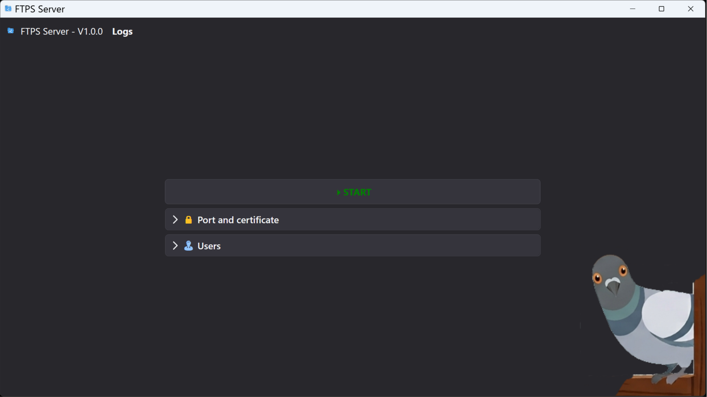
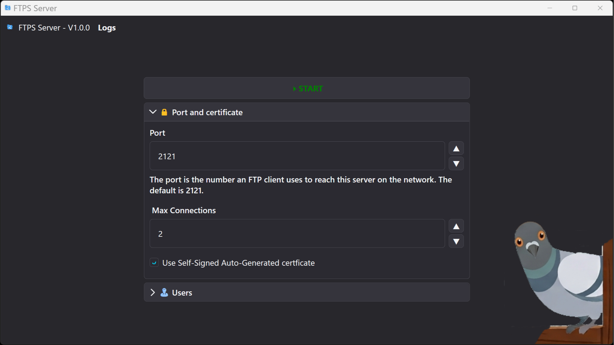
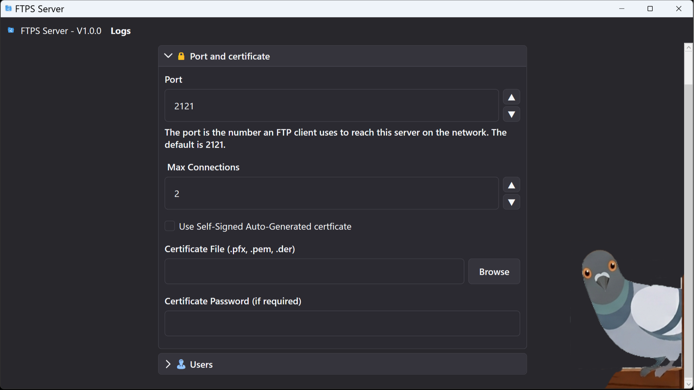
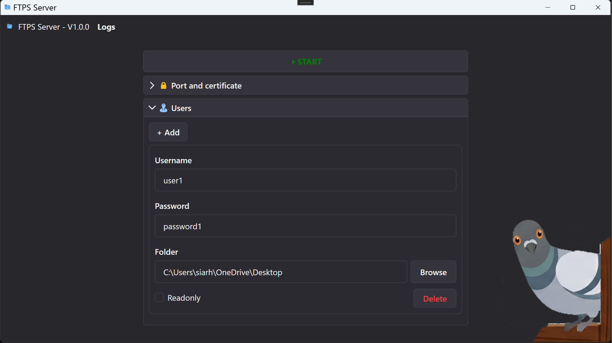
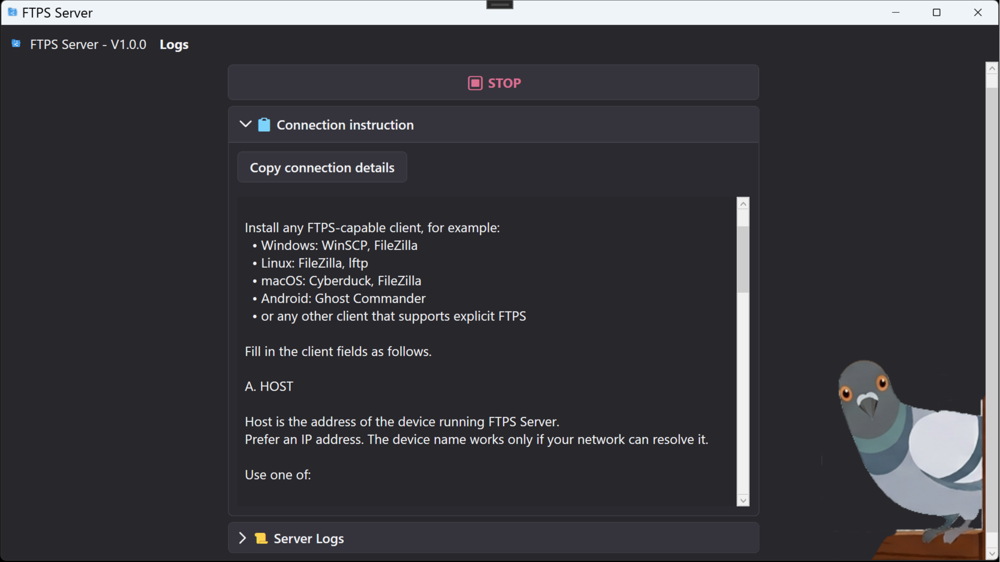
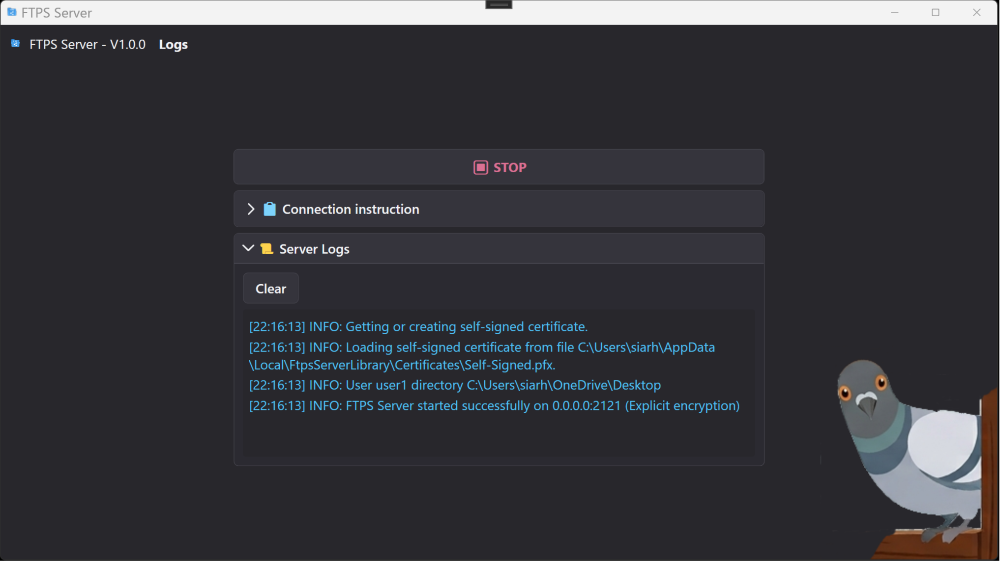

# Sharing files via FTPS betweeen devices over network.

Desktop and console apps are written in C# (.NET 10) for Windows, Android and Linux. For Android Kotlin-based implementation also exists.

Features:

- **User Permissions** - Granular control over Read/Write operations
- **Per-User Root Folders** - Isolated directories for each user
- **Path Security** - Protection against directory traversal attacks
- **UTF-8** - Supports localized characters

| Component                      |                                                                                   |
|--------------------------------|-----------------------------------------------------------------------------------|
| [Desktop](./README_UI.md) | [Microsoft Store](https://apps.microsoft.com/detail/9phpg7b75s0t) [Ubuntu](./Ubuntu.md) |
| [Android](./README_ANDROID.md) | [RuStore](https://www.rustore.ru/catalog/app/com.siarheikuchuk.ftpsserver) [Huawei](https://appgallery.huawei.com/app/C118829925) [FDroid](https://f-droid.org/packages/com.siarheikuchuk.ftpsserver/) [Google Play (review pending)](./README_ANDROID.md) |
| [Console](./README_CONSOLE.md) |                                                                                   |
| [Library](./README_NUGET.md)   | [NUGet Package](https://www.nuget.org/packages/Siarhei_Kuchuk.FtpsServerLibrary)  |

[Troubleshooting](./Troubleshooting.md)
