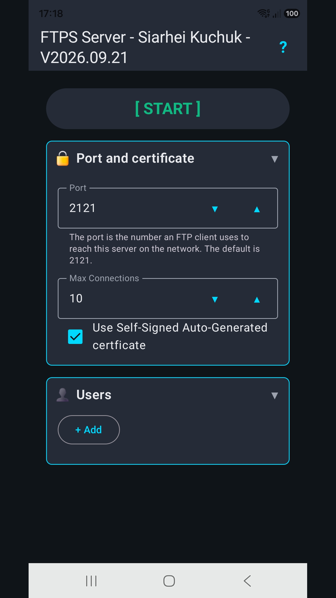
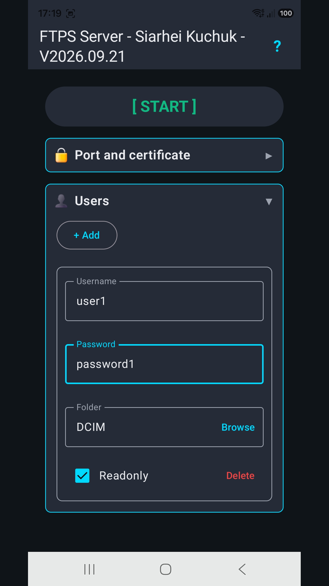
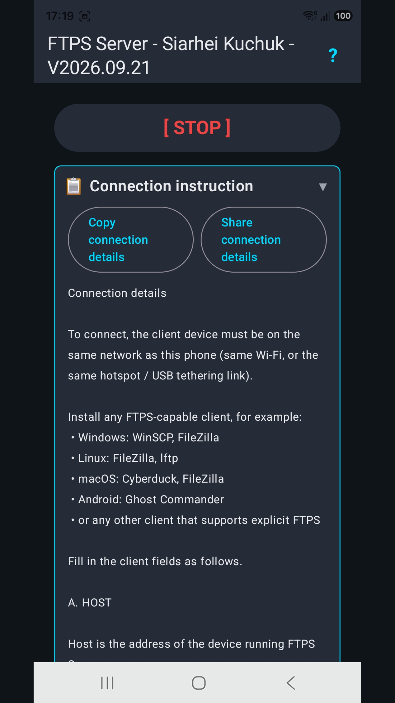
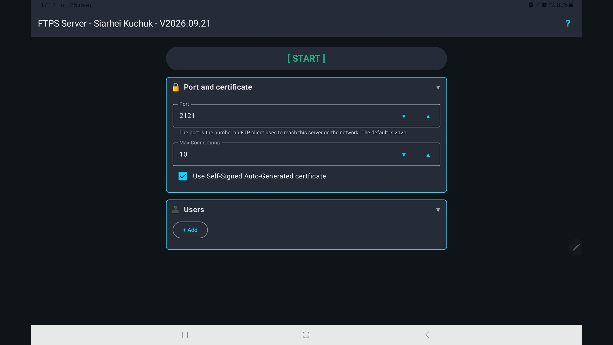
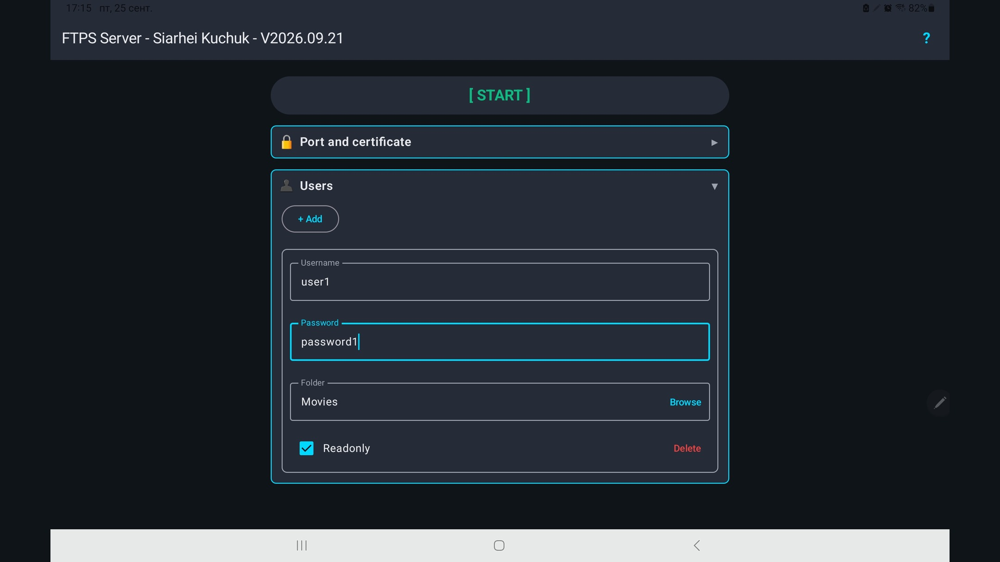
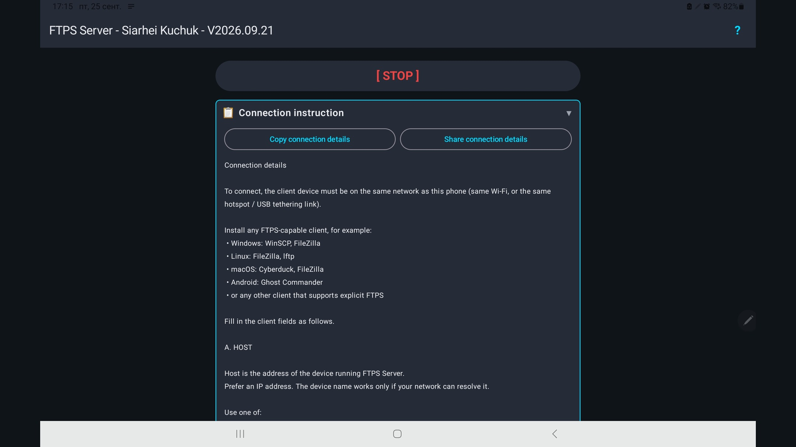

## Screenshots

Phone:



Tablet:





## Privacy policy (Android)

Store listings should use this language-selection page (after it is on the default branch):

https://github.com/drweb86/dotnet-ftps-server/blob/main/privacy/android/README.md

The English source is [privacy/android/en.md](./privacy/android/en.md). Localized copies live in the same folder. The root [PRIVACY.md](./PRIVACY.md) is unchanged and is for other store submissions.

## Installation

Stores:
- [RuStore](https://www.rustore.ru/catalog/app/com.siarheikuchuk.ftpsserver)
- Google Play (see bottom)

Manually:
- Release contains prebuilt asset `ftpsserver_<version>_android.apk`.
Tap the downloaded APK in the browser download list, or open it from the Android `Downloads` app. If Android blocks the install, tap `Settings` and enable `Allow from this source` for the browser or file manager you used, go back and Install.

Because app is self-signed, Android will ask you to confirm that you trust the APK before installing it. When Google Play Protect shows a warning for the self-signed APK, choose the option to install anyway if you trust this project. On Samsung devices click Details, Install anyway.

## Updating

If you install from an app store, that store updates the app. The Android app does not check for updates itself. For a sideloaded APK, install a newer APK over the existing one.

Android requires all updates for the same app to be signed with the same signing key. If Android says the package conflicts with an existing app or the signature does not match, uninstall the old app first, then install the new APK.

## Usage

Start FTPS Server, add at least one user, choose a shared folder, and tap `Start`. While the server is running, a notification stays on screen and the app keeps the CPU and Wi-Fi awake so transfers continue with the screen off. Once you done your transfers, you must stop server.

## Source code

There're 2 implementations:

a. Dotnet 10 Avalonia based

This is historically first version. However FOSS stores do not approve dotnet based apps and those which size are above 30MB. So this version is still there for your own needs to create implementation, but it won't be deployed. So its workable version.

b. Kotlin app (Current)

This is current version.

Build in Powershell:

```powershell
./sources/android/check-local.ps1
./sources/android/check-local.ps1 -Install
```

The default debug run builds three APKs with different package ids so they can sit on one phone: screenshots (`general`, English-only), general debug, and China PIPL debug (`-ChinaPipl` is not required for that). `-Install` installs all three.

Screenshots version uses English locale and has a different id from the release app.
Debug version will have different id from release app.


## Help list FTPS Server on Google Play

Google Play will not publish this app until **12 people** stay in closed testing for **14 days**. If you have an Android phone and a Google account, you can help.

**Do this in order, with the same Google account that is on the phone:**

1. Join the tester group: https://groups.google.com/g/ftpsserver-play-testers  
   (group email: `ftpsserver-play-testers@googlegroups.com`)
2. Open this Play link on the phone and tap **Become a tester**:  
   `https://play.google.com/store/apps/details?id=com.siarheikuchuk.ftpsserver`
3. Install **FTPS Server** from Play and leave the tester opt-in on for 14 days.

Joining the group alone is not enough. The Play link only works after you have joined the group. Do not leave the group or the test during those 14 days.
